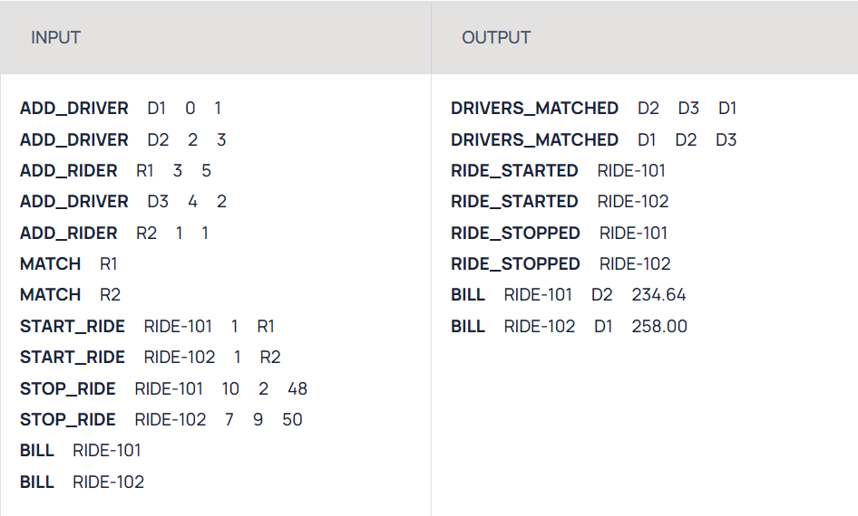

# Ride Sharing

## Problem Statement
The goal is to build a solution that matches riders with drivers based on their location and generates a bill for the ride.

## Assumptions
1. It is guaranteed that no two drivers or riders will have the same id.
2. A ride can only be started once the match is completed.
3. Every start ride request will happen after the match request.
4. Every start ride request will have a valid rider id.
5. One rider can make multiple match requests.
6. The bill for the ride will be calculated based on the distance between the rider's location and the destination.
7. The bill can only be generated after the ride is completed.
8. The driver will not be available to accept another rider's request after the ride has started.
9. The time taken for a ride cannot be negative.
10. All floating-point numerical values must be rounded to two decimal places.

## Solution Overview
This service provides the following functionalities:
1. **Match Riders with Drivers**: Match riders with the nearest available drivers based on their location.
2. **Start Ride**: Initiate a ride after a match has been made.
3. **Generate Bill**: Calculate the bill for the ride based on the distance traveled, once the ride is completed.

## Sample Input and Output

